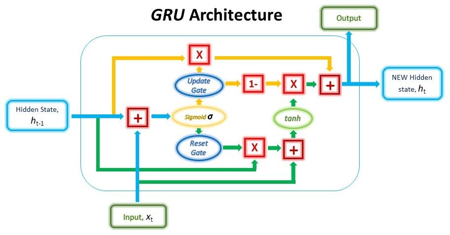
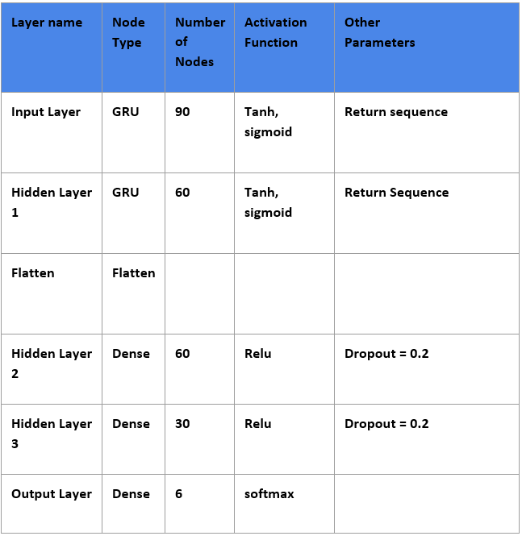
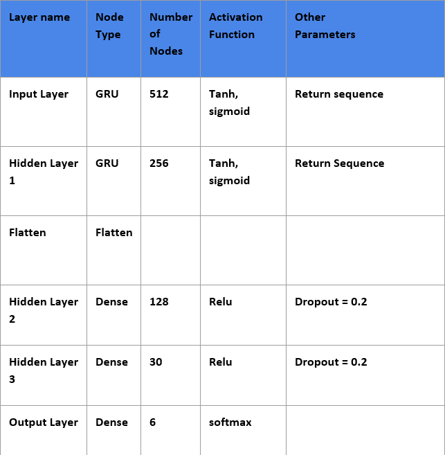
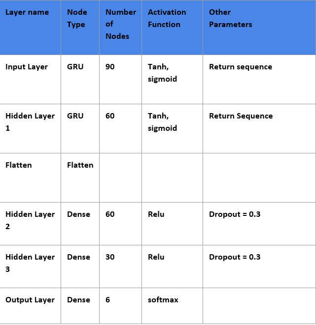
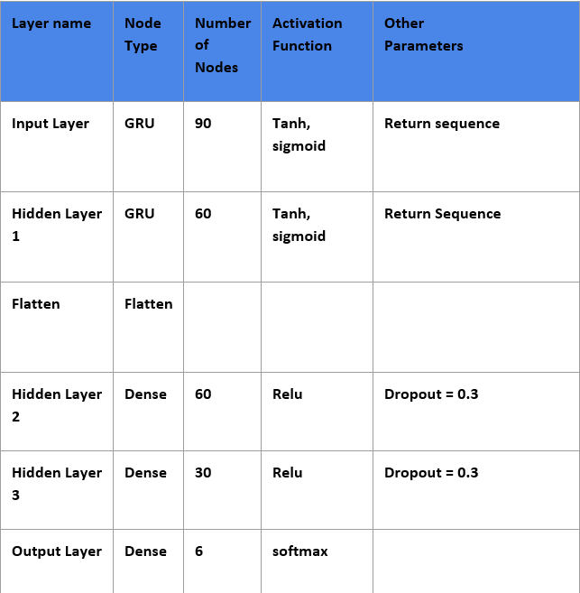

# Emotion Recognition in Human Voice Audio

Jack Charbonneau, Jannik Haas, Sitanshu Rupani, Ronak Sankaranarayanan, Anthony Topper

### CREMA Dataset

**Crowd-sourced Emotional Mutimodal Actors**

https://www.kaggle.com/ejlok1/cremad

- 7,442 audio clips of one sentence each

- Clips come from 91 actors

- Six Emotions

- - Anger, Disgust, Fear, Happy, Neutral, Sad

- Four levels of emotion

- - Low, Medium, High, Unspecified

### Feature Extraction

* Periodogram

* Intensity

* Fundamental Frequency

* Harmonicity

### The Model 
#### Recurrent Neural Network (RNN) :  

The RNN process information by taking the current value and the previous unit output values. The previous unit output values act as neural network memory. Both the values are concatenated and passed through an activation function and passes the value as the output of the unit and propagates the value as hidden state to the next unit.

#### Gated Recurrent Unit (GRU) : 

Gated Recurrent Unit(GRU) are a type of RNN layer similar to Long Short Term Memory (LSTM) layer. They take the current input and past output as hidden state, concatenate it and pass it in a sigmoid function to get two gates Update Gate and Reset Gate. The Update gate decides how much of the data from previous hidden state has to been erased and how much of the current data has to be added . The Reset Gate decides how much of the past information has to been forgot. The gates are multiplied with hidden state changing the values in the hidden state. Tanh activation function is used to get intermediate value. The final value is a concatenation of tanh activation output and the updated hidden state. The output value has also been passed as new hidden state for the next unit.

#### Keras Layers : 
Keras is a deep learning framework that is widely used in almost every field. It provides different models and layers which can be easily modified by the user according to the need of the model. 
Few of the keras layers used are as follows.

##### GRU Layer Keras : 
The GRU layer defined by keras creates the specified number of units of GRU. The GRU layer’s recurrent activation and final activation can be controlled by passing the parameters. The default values are sigmoid and tanh respectively. The Recurrent also allows a dropout ratio on the parameters initially defined as 0. The GRU layer takes a 3-dimensional data as its input value with time as the extra dimension. The return_sequence parameter if assigned true, the output of the GRU will also be in 3-dimensional to pass it for the next GRU layer. 

##### Flatten Keras : 
The flatten lalyer from keras makes multidimensional data to one dimensional data which can be processed by Dense layer. 

##### Dense Layer : 
Dense Layer is the normal neural network units that take multiple inputs , applies weight on each of the input and adds a bias variable to get the output of a single neural unit. The output can also be passed to a activation function and then propagated to all the nodes in the next layer. The values of weights and bias are backpropagated from the final error rate. 

Finally the Keras models compiled mentioning the loss function the model should try to reduce and the optimizer the model should use. 
After this, the keras model can be fit and trained using a training dataset. A validation dataset can also be passed to check the performance of the model in each iteration on a completely new dataset. After training, the model can be used to predict on the testing data.

### Model : 

#### Architecture : 
The input layer will be the GRU layer which will take the 3-dimensional input of the audio features with batch size 128. The initial GRU layer will return a 3-dimensional output data to the next GRU layer as the return_sequence = TRUE. A flatten layer is used to convert the 3-dimensional data into 1-dimensional data to be processed by the Dense layer with activation function as rectifier linear unit. The final output layer consists of 6 nodes each representing the label of the target function. The model is compiled with categorical_crossentropy as the loss value and adam optimizer as the optimization algorithm. The Model is trained with 70% of the total audio data sampled randomly and tested on the rest 30% of the audio data.

#### Other models from hyper parameter tuning:
We tried multiple models with different structure in the nodes and layer to check their performance in the test data. The model mentioned above is acquired as optimal model from cross validation. 

#### Model 1 : With LSTM

#### Model 2 : Increased number of nodes

#### Model 3 : Increased dropout ration in the Dense layer

#### Model 4 : Extra hidden Dense layer.

#### Model 5 : Removing the hidden GRU layer

#### Model 6 : Batch size 32

### Results:

#### Training on the final model

As you can see from the plot below, the training over 100 epochs showed a significant decrease in the loss.

#### Binary Classification

We first trained and tested our model on binary classification using only the Happy and Sad audio files. This would provide a good baseline model performance since binary classification is much simpler than multiclass classification. The labels Happy and Sad were chosen out of the six emotions because they were the most opposite to each other. 
After training for 100 epochs, the model was able to achieve a training accuracy of 88.93% and a testing accuracy of 77.98%.

#### Multiclass Classification

The model was then also trained and tested on all 6 of the emotions in a much more complex multiclass classification setting. The model was able to achieve 61.53% training accuracy and 31.80% testing accuracy after 100 epochs. 

### Conclusion

Emotion recognition using timeseries voice data is a very new and highly complex problem and is in high demand with the increase of smart assistants such as 'Siri' and 'Alexa'. We found that our model was able to perform well in a simple binary classification setting, but was unable to accurately identify between all 6 of the emotions present in this dataset. This shows that the model was able to learn and identify the large difference between Happy and Sad emotions, but was unable to learn the more subtle differences in voice data for the other emotions. 

### Future Work

We would like to experiment with and implement more complex feature extraction methods to see what kind of features help to distinguish between emotions in human speech. We would also like to implement some data augmentation methods in order to both increase our dataset as well as building a more robust model that is not as susceptible to errors caused by noise in the data. 

### References

- CREMA - https://github.com/CheyneyComputerScience/CREMA-D
- Parselmouth - https://parselmouth.readthedocs.io/en/stable/
- Paper Source - https://www.aclweb.org/anthology/D18-1280/
- GRU - https://blog.floydhub.com/gru-with-pytorch/
